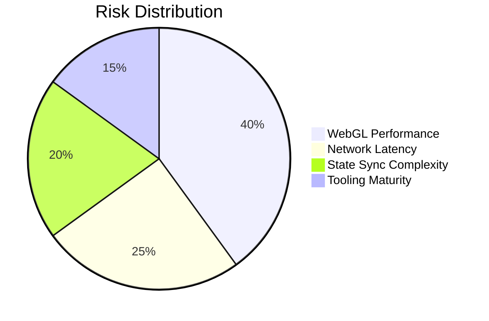
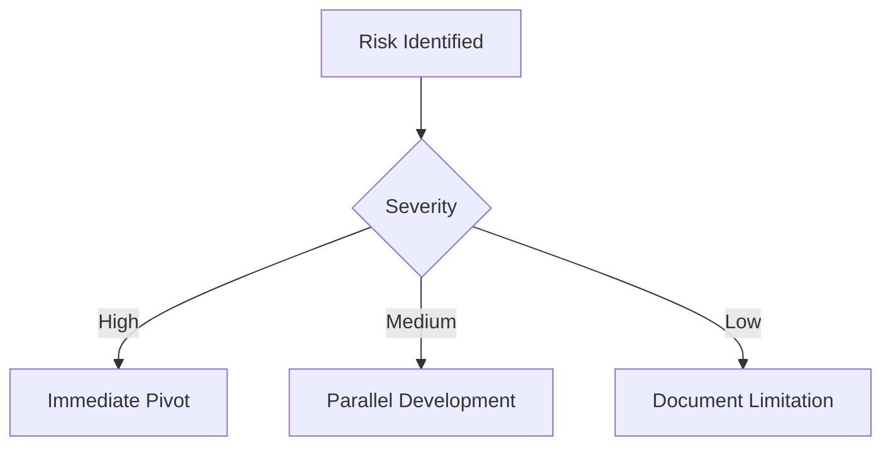
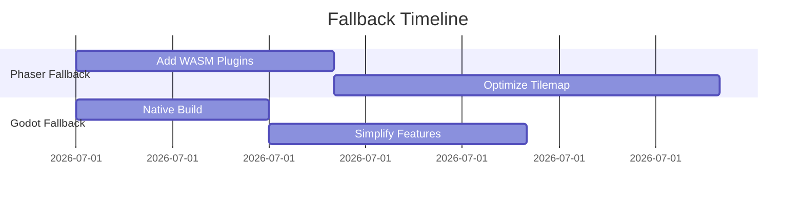

# Prototype Risk Management

## Key Risks


## Mitigation Strategies


## Contingency Plan


## Decision Criteria
```mermaid
graph TD
    A[Prototype Results] --> B{All Metrics Met?}
    B -->|Yes| C[Adopt Engine]
    B -->|No| D{Which Failed?}
    D --> E[Performance] --> F[Optimize]
    D --> G[Network] --> H[Re-architect]
    D --> I[Workflow] --> J[Tooling Improvements]