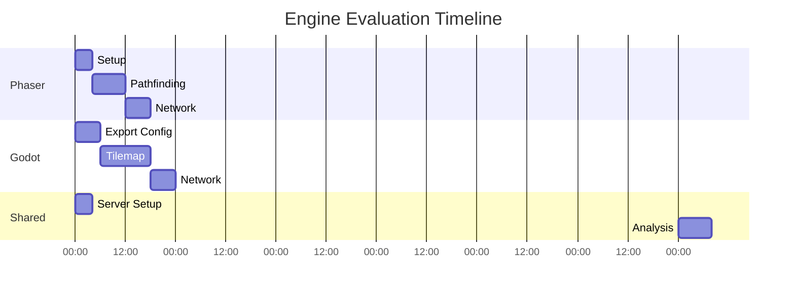
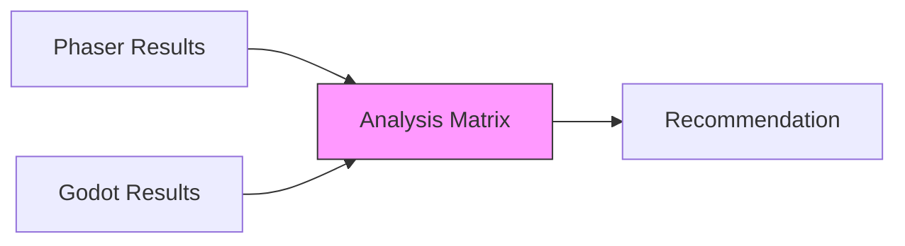

# Engine Evaluation Task List

## Parallel Implementation Timeline (7 Days)

## Detailed Task Breakdown

### Phaser Prototype Tasks
| Task | Description | Est. Time | Dependencies | Acceptance Criteria |
|------|-------------|-----------|--------------|---------------------|
| P1 | Setup Webpack/TS | 4h | - | `npm run dev` starts server |
| P2 | Implement Tilemap | 6h | P1 | 500x500 map renders at 60fps |
| P3 | Integrate EasyStar | 4h | P2 | Pathfinding visualization working |
| P4 | Socket.IO Client | 4h | P1 | Connect to test server |

### Godot Prototype Tasks
| Task | Description | Est. Time | Dependencies | Acceptance Criteria |
|------|-------------|-----------|--------------|---------------------|
| G1 | Configure Web Export | 4h | - | HTML5 export succeeds |
| G2 | Build Tilemap Scene | 8h | G1 | Multi-layer map with collisions |
| G3 | Implement AStarGrid | 6h | G2 | Path lines visible on map |
| G4 | WebSocket Client | 4h | G1 | Binary protocol handshake |

### Shared Infrastructure Tasks
| Task | Description | Est. Time | Dependencies |
|------|-------------|-----------|--------------|
| S1 | Setup Node.js Server | 2h | - |
| S2 | WebSocket Test Endpoint | 2h | S1 |
| S3 | Load Testing Scripts | 4h | S2 |
| S4 | Metrics Dashboard | 4h | S3 |

## Comparative Analysis Framework

### Evaluation Metrics
1. **Performance**
   - FPS during stress tests
   - Memory usage patterns
   - Network latency percentiles

2. **Code Complexity**
   - Lines of Code (CLOC)
   - Dependency count
   - Cyclomatic complexity

3. **Network Handling**
   - Message throughput
   - Binary vs JSON efficiency
   - Reconnection stability