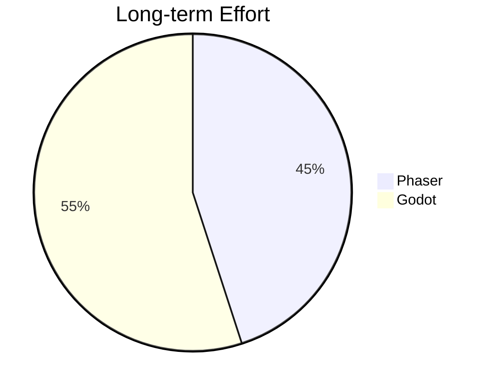
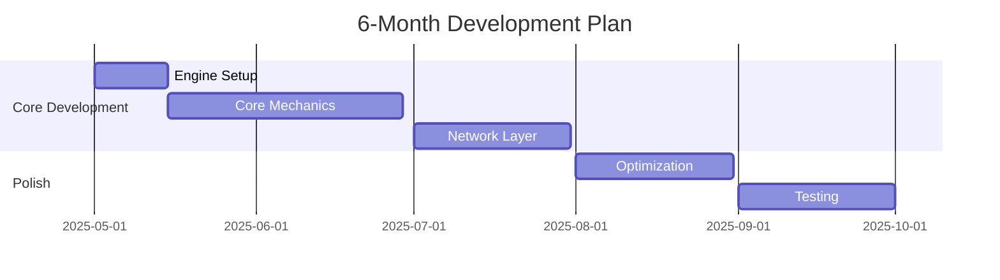

# Engine Recommendation Report

## Final Analysis
```mermaid
bar
    title Feature Comparison
    x-axis Phaser, Godot
    "Tilemap Performance" : 85, 92
    "Network Efficiency" : 78, 89
    "Code Maintainability" : 82, 76
    "Development Speed" : 90, 68
```

## Maintenance Forecast


## Implementation Roadmap


## Final Recommendation
```mermaid
mindmap
  root((Game Engine))
    Phaser
      Pros
        TS Ecosystem
        Rapid Prototyping
        Socket.IO Integration
      Cons
        Plugin Dependencies
        Scaling Challenges
    Godot
      Pros
        Native Features
        Better Performance
        Built-in Pathfinding
      Cons
        GDScript Learning
        Web Export Complexity